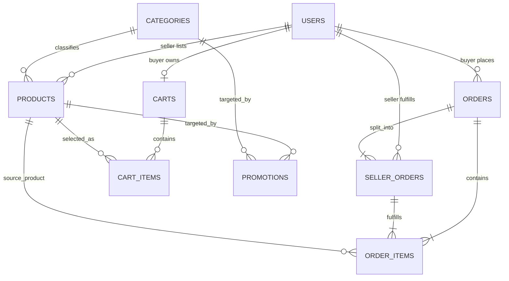
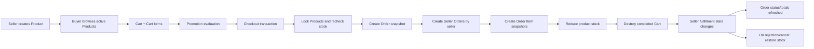
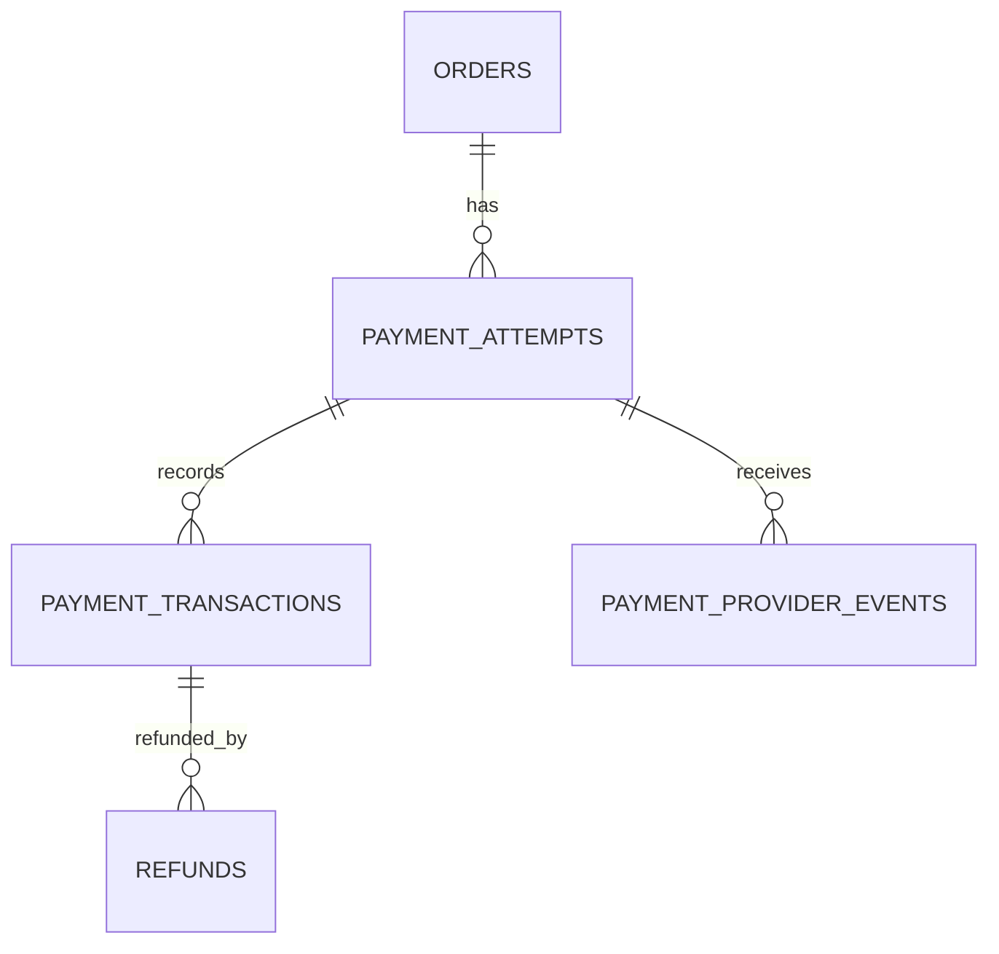

# Database Architecture and Performance Audit

**Project:** Rediff Store Rails e-commerce application  
**Audit basis:** repository state on 2026-08-04  
**Database:** PostgreSQL through Rails 8.1 / Active Record  
**Authoritative sources reviewed:** `db/schema.rb`, all migrations, all models, controllers, helpers, views, seeds, and the Solid Cache/Queue/Cable schema files

## 1. Executive summary

The commerce database has a sound small-store core: users, products, categories, carts, orders, seller-specific fulfillment, order lines, and promotions are separated sensibly. The checkout transaction locks stock, snapshots mutable product/promotion data, creates one seller sub-order per seller, decrements inventory, and deletes the completed cart. That is a good foundation.

The primary schema contains **9 business tables**. The repository also defines **13 Rails operational tables**: 1 cache table, 11 queue tables, and 1 WebSocket message table. These are infrastructure, not commerce domain data.

The central recommendation is **not** to broadly denormalize the database. At this project size, proper composite indexes, pagination, eager loading, set-based aggregates, and stronger constraints will give most of the speed benefit without synchronization bugs. Keep strict normalization for payment records when payments are introduced. Use controlled snapshots and a few summary columns only on read-heavy, immutable order data.

Highest-priority findings:

1. **There is no payment schema at all.** The UI calls checkout a transaction, but no payment, payment attempt, refund, provider event, or idempotency record exists. An order being created currently means “confirmed,” not “paid.”
2. **Many integrity rules exist only in Ruby.** Direct SQL, a bug, concurrent code, or a future service can insert invalid roles, statuses, promotion shapes, null prices, null quantities, and negative monetary values.
3. **`order_items` can contradict `seller_orders`.** It stores both `order_id` and `seller_order_id`, but the database does not guarantee that the selected seller order belongs to the same order.
4. **Promotion selection scales poorly.** It loads every active automatic promotion and evaluates every promotion against every cart item in Ruby: approximately `O(promotions × cart_items)` per cart/checkout calculation.
5. **Seller order totals cause N+1 aggregate queries.** The seller list performs one `SUM` per displayed seller order; the admin order page performs two `SUM`s per seller order even though order items were preloaded.
6. **Most lists are unpaginated and several common filter/sort patterns lack composite indexes.** This will become more important than denormalization as data grows.
7. **Production operational database configuration appears incomplete.** `production.rb` refers to named `queue` and `cable` databases and the schema files imply `cache`, `queue`, and `cable` databases, but `config/database.yml` defines only one flat production connection.
8. **Live row counts and query plans could not be measured.** PostgreSQL was not reachable from this workspace, so performance conclusions are static analysis, not production `EXPLAIN (ANALYZE, BUFFERS)` measurements.

## 2. What “schema” means in this project

There are two related meanings:

- **PostgreSQL namespace:** the application does not explicitly configure a PostgreSQL `schema_search_path`, so the business tables normally live in PostgreSQL's `public` schema.
- **Rails schema dump / database role:** the repository has four schema files. `db/schema.rb` is the primary commerce schema. `db/cache_schema.rb`, `db/queue_schema.rb`, and `db/cable_schema.rb` describe Rails infrastructure stores intended to be separate production database roles/databases.

Rails also creates internal `schema_migrations` and `ar_internal_metadata` tables at runtime. They are framework bookkeeping and are intentionally not declared in the schema dumps below.

## 3. Current business ER diagram

Important interpretation:

- One buyer has at most one cart because `carts.buyer_id` is unique.
- One order is divided into one `seller_order` for every seller represented in that order.
- Every order item points to the overall order, its seller-specific order, and its source product.
- A promotion may target one product, one category, or neither, depending on `kind`; the database itself does not enforce that shape.
- The diagram shows application intent. Some cardinalities such as “an order must have at least one item” cannot be enforced by an ordinary foreign key and are currently enforced only by the checkout flow.

## 4. End-to-end data flow

### Checkout behavior

`Order#place_from_cart` wraps order creation in one database transaction. It loads cart items/products, locks each product, checks availability and stock, calculates the promotion, stores order totals and promotion snapshots, groups lines by seller, creates seller orders and order items, decrements stock, and destroys the cart.

This is correct in spirit, but product locks should be acquired in a deterministic order (for example, ascending product ID) to reduce deadlock risk when two carts contain the same products in different sequences.

### Fulfillment behavior

Each seller order moves through `confirmed → processing → shipped → delivered`; `confirmed` or `processing` may instead become `rejected` or `canceled`. Rejection/cancellation restores stock and refreshes the parent order. The parent status is a derived summary of active seller-order statuses, and its monetary totals are recomputed from active order items.

Concurrent seller updates can race while both refresh the same parent order. Lock the parent order consistently during status/total refresh and define one lock ordering across order, seller orders, and products.

## 5. Complete primary commerce table dictionary

All primary keys named `id` are implicit `bigint` primary keys. All tables have non-null `created_at` and `updated_at` timestamps unless stated otherwise.

### `users`

Purpose: authentication and all buyer, seller, and admin identities in a single table.

| Field | Type / default / null | Meaning |
|---|---|---|
| `id` | bigint PK | User identity |
| `name` | string, NOT NULL | Display/customer name |
| `role` | integer, default 0, NOT NULL | Rails enum: buyer=0, seller=1, admin=2 |
| `email` | string, default `''`, NOT NULL | Devise login identifier |
| `encrypted_password` | string, default `''`, NOT NULL | Password hash, never plaintext |
| `reset_password_token` | string, nullable | Devise recovery token |
| `reset_password_sent_at` | datetime, nullable | Recovery timestamp |
| `remember_created_at` | datetime, nullable | Remember-me timestamp |
| `created_at`, `updated_at` | datetime, NOT NULL | Audit timestamps |

Indexes: unique `email`; unique `reset_password_token`.  
Foreign-key consumers: products/seller orders reference sellers; carts/orders reference buyers.  
Gap: no database check restricts `role` to 0–2; email uniqueness is case-sensitive at the database layer.

### `categories`

Purpose: reusable product classification.

| Field | Type / default / null | Meaning |
|---|---|---|
| `id` | bigint PK | Category identity |
| `name` | string, nullable in DB | Category name; Rails requires presence/uniqueness |
| `description` | text, nullable | Category description |
| timestamps | datetime, NOT NULL | Audit timestamps |

Indexes: none beyond PK.  
Gap: Rails validates unique/nonblank names, but the database has neither `NOT NULL` nor a unique index. Concurrent inserts can create duplicates.

### `products`

Purpose: seller-owned live catalog and inventory.

| Field | Type / default / null | Meaning |
|---|---|---|
| `id` | bigint PK | Product identity |
| `seller_id` | bigint, NOT NULL, FK → users | Owning seller |
| `category_id` | bigint, NOT NULL, FK → categories | Product category |
| `title` | string, nullable in DB | Product title |
| `description` | text, nullable | Product description |
| `price` | decimal(10,2), nullable in DB | Current catalog price |
| `stock` | integer, default 0, nullable in DB | Current available units |
| `active` | boolean, default true, NOT NULL | Soft archive/availability flag |
| timestamps | datetime, NOT NULL | Audit timestamps |

Indexes: `seller_id`; `category_id`.  
Checks: `stock >= 0` (but SQL NULL still passes).  
Gap: title, price, and stock are protected by Rails validation but not `NOT NULL`; price has no DB nonnegative check.

### `carts`

Purpose: one mutable current cart per buyer.

| Field | Type / default / null | Meaning |
|---|---|---|
| `id` | bigint PK | Cart identity |
| `buyer_id` | bigint, NOT NULL, FK → users | Cart owner |
| timestamps | datetime, NOT NULL | Audit timestamps |

Indexes: unique `buyer_id`.  
Normalization: clean one-to-one owner entity. A cart does not snapshot prices because catalog prices are intentionally recalculated until purchase.

### `cart_items`

Purpose: many-to-many intersection between the current cart and products, with quantity.

| Field | Type / default / null | Meaning |
|---|---|---|
| `id` | bigint PK | Line identity |
| `cart_id` | bigint, NOT NULL, FK → carts | Parent cart |
| `product_id` | bigint, NOT NULL, FK → products | Selected product |
| `quantity` | integer, nullable in DB | Desired quantity |
| timestamps | datetime, NOT NULL | Audit timestamps |

Indexes: `cart_id`; `product_id`; unique `(cart_id, product_id)`.  
Checks: `quantity > 0` (but NULL passes).  
Gap: make quantity `NOT NULL`; optionally default to 1.

### `orders`

Purpose: buyer-level purchase and immutable checkout snapshot, plus a derived roll-up of seller fulfillment.

| Field | Type / default / null | Meaning |
|---|---|---|
| `id` | bigint PK | Order identity |
| `buyer_id` | bigint, NOT NULL, FK → users | Buyer account |
| `customer_name` | string, nullable in DB | Checkout-time recipient snapshot |
| `customer_email` | string, nullable in DB | Checkout-time contact snapshot |
| `customer_address` | text, nullable in DB | Checkout-time delivery snapshot |
| `total_amount` | decimal(10,2), default 0, nullable | Sum before discount for active lines |
| `discount_amount` | decimal(10,2), default 0, nullable | Store-funded discount snapshot |
| `final_amount` | decimal(10,2), default 0, nullable | Buyer total after discount |
| `promotion_code` | string, nullable | Applied code snapshot |
| `promotion_name` | string, nullable | Applied name snapshot |
| `promotion_kind` | string, nullable | Applied kind snapshot |
| `status` | string, default `confirmed`, nullable | Derived overall fulfillment status |
| `cancel_reason` | text, nullable | Whole-order cancellation explanation |
| `canceled_at` | datetime, nullable | Whole-order cancellation time |
| timestamps | datetime, NOT NULL | Audit timestamps |

Indexes: `buyer_id`.  
Good denormalization: customer, promotion, total, and status snapshots keep order history stable and make reads fast.  
Gaps: required customer/amount/status fields need DB constraints; amount relationships and allowed statuses are unchecked; there is no payment state.

### `seller_orders`

Purpose: per-seller fulfillment partition of an order.

| Field | Type / default / null | Meaning |
|---|---|---|
| `id` | bigint PK | Seller-order identity |
| `order_id` | bigint, NOT NULL, FK → orders | Parent buyer order |
| `seller_id` | bigint, NOT NULL, FK → users | Fulfilling seller |
| `status` | string, default `confirmed`, NOT NULL | AASM fulfillment state |
| `rejection_reason` | text, nullable | Seller rejection explanation |
| `rejected_at` | datetime, nullable | Rejection time |
| timestamps | datetime, NOT NULL | Audit timestamps |

Indexes: `order_id`; `seller_id`; unique `(order_id, seller_id)`.  
Gap: no allowed-status check and no rule tying rejection fields to rejected status. There is no `canceled_at` for a buyer-canceled seller part.

### `order_items`

Purpose: immutable line-item snapshot and link to current source product and seller fulfillment.

| Field | Type / default / null | Meaning |
|---|---|---|
| `id` | bigint PK | Order-line identity |
| `order_id` | bigint, NOT NULL, FK → orders | Direct parent order |
| `seller_order_id` | bigint, NOT NULL, FK → seller_orders | Seller fulfillment partition |
| `product_id` | bigint, NOT NULL, FK → products | Source product identity |
| `product_title` | string, NOT NULL | Purchased title snapshot |
| `quantity` | integer, default 1, nullable | Purchased units |
| `price` | decimal(10,2), nullable | Unit-price snapshot |
| `subtotal` | decimal(10,2), default 0, NOT NULL | `price × quantity` snapshot |
| `discount_amount` | decimal(10,2), default 0, NOT NULL | Allocated line discount |
| `final_amount` | decimal(10,2), default 0, NOT NULL | `subtotal - discount` snapshot |
| timestamps | datetime, NOT NULL | Audit timestamps |

Indexes: `order_id`; `seller_order_id`; `product_id`.  
Good denormalization: title, price, and calculated amounts preserve financial/order history and avoid catalog joins.  
Controlled redundancy: direct `order_id` is transitively derivable from `seller_order_id`, but is useful for common order queries. Keep it only if consistency is enforced with a composite foreign key or trigger.  
Gaps: quantity/price nullability; no positive/nonnegative checks; no arithmetic consistency checks.

### `promotions`

Purpose: one flexible table for coupon, product, category, and store-wide sale rules.

| Field | Type / default / null | Meaning |
|---|---|---|
| `id` | bigint PK | Promotion identity |
| `name` | string, NOT NULL | Admin/display name |
| `kind` | integer, default 0, NOT NULL | coupon=0, product_discount=1, category_discount=2, sale=3 |
| `code` | string, nullable | Coupon code only |
| `discount_percent` | integer, default 0, nullable | Percentage discount |
| `min_order_amount` | decimal(10,2), default 0, nullable | Minimum eligible cart subtotal |
| `product_id` | bigint, nullable, FK → products | Product target when applicable |
| `category_id` | bigint, nullable, FK → categories | Category target when applicable |
| `starts_at` | datetime, nullable | Eligibility start |
| `ends_at` | datetime, nullable | Eligibility end |
| `active` | boolean, default true, nullable | Admin activation flag |
| timestamps | datetime, NOT NULL | Audit timestamps |

Indexes: unique partial expression index on `LOWER(code)` when code is non-null; `product_id`; `category_id`.  
Trade-off: this intentionally denormalized “single table inheritance by kind” avoids several joins and models, which suits this small project.  
Gaps: the database does not enforce kind values, percent range, nonnegative minimum, date order, or kind-specific target shape.

## 6. Rails operational tables

These tables should not have commerce foreign keys and should not be included in business analytics. Their structure is owned by the corresponding Rails gems.

### Solid Cache (`db/cache_schema.rb`)

- `solid_cache_entries`: `id`; binary `key` (NOT NULL, max 1024); binary `value` (NOT NULL); `created_at` (NOT NULL); bigint-like `key_hash` (NOT NULL); integer `byte_size` (NOT NULL). Indexes on `byte_size`, `(key_hash, byte_size)`, and unique `key_hash`.

### Solid Queue (`db/queue_schema.rb`)

- `solid_queue_jobs`: `id`, `queue_name`, `class_name`, `arguments`, `priority=0`, `active_job_id`, `scheduled_at`, `finished_at`, `concurrency_key`, timestamps. This is the central job record.
- `solid_queue_blocked_executions`: `id`, `job_id`, `queue_name`, `priority=0`, `concurrency_key`, `expires_at`, `created_at`; FK job with cascade delete.
- `solid_queue_claimed_executions`: `id`, `job_id`, `process_id`, `created_at`; FK job with cascade delete.
- `solid_queue_failed_executions`: `id`, `job_id`, `error`, `created_at`; FK job with cascade delete.
- `solid_queue_ready_executions`: `id`, `job_id`, `queue_name`, `priority=0`, `created_at`; FK job with cascade delete.
- `solid_queue_scheduled_executions`: `id`, `job_id`, `queue_name`, `priority=0`, `scheduled_at`, `created_at`; FK job with cascade delete.
- `solid_queue_recurring_executions`: `id`, `job_id`, `task_key`, `run_at`, `created_at`; FK job with cascade delete.
- `solid_queue_recurring_tasks`: `id`, `key`, `schedule`, `command`, `class_name`, `arguments`, `queue_name`, `priority=0`, `static=true`, `description`, timestamps.
- `solid_queue_pauses`: `id`, `queue_name`, `created_at`.
- `solid_queue_processes`: `id`, `kind`, `last_heartbeat_at`, `supervisor_id`, `pid`, `hostname`, `metadata`, `created_at`, `name`; `supervisor_id` is indexed but not declared as a self-FK.
- `solid_queue_semaphores`: `id`, `key`, `value=1`, `expires_at`, timestamps.

The dump contains polling, dispatch, uniqueness, heartbeat, and maintenance indexes appropriate to Solid Queue. Do not hand-denormalize these tables.

### Solid Cable (`db/cable_schema.rb`)

- `solid_cable_messages`: `id`; binary `channel` (NOT NULL, max 1024); binary `payload` (NOT NULL); `created_at` (NOT NULL); bigint-like `channel_hash` (NOT NULL). Indexed by channel, channel hash, and creation time.

Production retains messages for one day according to `config/cable.yml`.

## 7. Normalization assessment

### Already normalized appropriately

| Area | Assessment | Decision |
|---|---|---|
| users → products/orders/carts | Ownership represented by foreign keys | Keep |
| categories → products | Category data stored once | Keep |
| carts ↔ products | Proper intersection table with quantity and unique pair | Keep |
| orders → seller_orders | Correct decomposition for multi-seller fulfillment | Keep |
| seller_orders → order_items | Correct seller-specific grouping | Keep |
| products/categories → promotions | Nullable targeting FKs avoid copied names | Keep for current scope |
| framework stores | Vendor-designed normalized operational structures | Do not modify |

### Correct and intentional denormalization

| Duplicate/derived data | Why it is correct | Required protection |
|---|---|---|
| order customer name/email/address | Delivery history must not change when a user edits their account | Make immutable after placement; add NOT NULL |
| order promotion name/kind/code | Historical receipt must survive promotion edits/deactivation | Store `promotion_id` too if audit linkage is desired, but do not depend on it for display |
| order total/discount/final amounts | Fast receipt/history reads and historical truth | Set inside checkout; constrain arithmetic; prevent arbitrary later edits |
| order-item title/price/subtotal/discount/final | Product titles/prices change; financial lines must not | Strong constraints and immutability |
| parent order status | Fast buyer/admin list display across many seller parts | Update transactionally while parent order is locked |
| `order_items.order_id` | Avoids joining through seller order for all order-line reads | Enforce agreement with `seller_order_id` |

### Needs stronger normalization or integrity

“Normalize” here mainly means making one fact have one authoritative representation or enforcing duplicated facts—not necessarily adding more tables.

1. **Payment domain is missing:** add normalized payment entities described in section 10.
2. **Order-item parent contradiction:** add a unique key on `seller_orders(id, order_id)` and composite FK from `order_items(seller_order_id, order_id)`, or remove direct `order_id`. For this project, keep it and enforce it.
3. **Promotion shape:** the current single table is query-friendly, but add check constraints so only the target appropriate to `kind` may be populated. Splitting into four promotion tables would be more textbook-normalized but would make this project’s selection query and admin UI more complex with little current benefit.
4. **Role semantics:** one `users` table is appropriate while every account has exactly one role. If users may later be both buyer and seller, normalize into `roles` and `user_roles`; do not do that preemptively.
5. **Addresses:** order addresses should remain snapshots. Add a normalized `user_addresses` table only for a saved-address feature, then copy the selected address into the order at checkout.
6. **Inventory history:** `products.stock` is only a current balance. For auditing and reconciliation, add immutable `inventory_movements`; retain `products.stock` as the fast current balance.

## 8. Complex or inefficient query paths

### A. Automatic promotion selection — highest algorithmic cost

Location: `Promotion.best_for`, `discount_total`, and `discounts_for`.

Current behavior:

1. Fetch every active product/category/sale promotion.
2. In Ruby, loop through all promotions (`max_by`).
3. For each promotion, loop through every cart line and calculate discounts.
4. Calculate the winning promotion’s discount again after selection.

Cost grows roughly with active promotions × cart lines, and the database cannot efficiently discard promotions unrelated to products/categories in the cart.

Improve first without denormalizing:

- Extract cart `product_id` and `category_id` values and SQL-filter candidates to global sales, matching products, and matching categories.
- Filter eligibility windows in SQL (`starts_at IS NULL OR starts_at <= now`, likewise `ends_at`).
- Add an index supporting the candidate query; exact design should follow an `EXPLAIN` on real data.
- Calculate each candidate once and retain its line-discount result.
- Cache the small active-promotion rule set with invalidation after admin changes if reads greatly exceed writes.

Denormalize only at high scale: maintain a derived `effective_product_promotions(product_id, promotion_id, starts_at, ends_at, priority/discount)` projection or materialized view. This makes reads simple but requires refresh/invalidation whenever a product changes category or a promotion changes.

### B. Seller order list totals — confirmed N+1 aggregates

Location: seller orders index calls `seller_order.seller_total`; the method executes `order_items.sum(:subtotal)` for every seller order. Preloading `order_items` does not prevent SQL `SUM` calls.

Improve now: return totals with one grouped SQL query or select joined aggregates, and paginate.  
Good denormalization candidate: add `item_count`, `subtotal_amount`, `discount_amount`, and `final_amount` to `seller_orders`. Order lines are immutable after checkout, so these summaries have low synchronization risk and make seller dashboards/listing queries trivial.

### C. Admin order detail totals — two queries per seller part

Location: admin order view calls both `seller_total` and `promotion_total` for every seller order.

This produces `2 × seller_order_count` aggregate queries even after lines are included. Use the same grouped query or seller-order summary columns recommended above.

### D. Parent order refresh — association work plus three SUM queries

Location: `Order#refresh_status`.

It loads/rejects seller parts in Ruby and executes three separate sums over the same active lines. Replace with a single SQL aggregate selecting all three sums. The order’s existing total columns are already the correct denormalized read model; make their refresh atomic and lock the parent.

### E. Buyer order history — avoid one COUNT per order

The controller preloads `order_items`, but the view calls `order.order_items.count`. Active Record `count` normally issues SQL; use `size` to use the loaded collection. Pagination is also required before the table grows.

### F. Product/category/order listing patterns — index and pagination issue

Common patterns include:

- active products ordered newest globally and inside category;
- seller products ordered newest;
- buyer orders ordered newest;
- seller orders ordered newest;
- all admin orders ordered newest;
- category counts grouped by `category_id`.

Existing single-column foreign-key indexes help filtering but often still require a sort. Candidate indexes are listed in section 9. All current index actions except dashboards are effectively unbounded.

### G. Cart data repeated across layout and pages

The navbar calls a quantity `SUM` on every buyer request. Product grids initialize/look up the cart item collection, and cart/checkout calculate summaries multiple times. This is not yet severe, and `cart_item_for` memoizes its collection per request, so it is not one query per product. Prefer one request-scoped cart summary and pass it to the layout/view. Do not persist cart subtotal because product prices and promotions remain mutable.

### H. Checkout and stock restoration loops

Checkout performs row-by-row locks, inserts, and stock updates. Rejection restores stock line by line with locks. Correctness is more important than making this one giant query, but:

- lock products in sorted ID order;
- use atomic updates (`stock = stock - quantity` with `stock >= quantity`) where practical;
- bulk insert immutable order lines after validation if carts become large;
- use one deterministic lock order in checkout, cancellation, and seller rejection;
- add an inventory movement ledger for auditability.

## 9. Index plan (before broad denormalization)

Validate every index with production-like data and `EXPLAIN (ANALYZE, BUFFERS)`. More indexes slow writes, so add only those serving measured paths.

| Priority | Candidate index | Supports |
|---|---|---|
| P0 | unique `categories(lower(name))` | DB-level case-insensitive category uniqueness |
| P0 | `(buyer_id, created_at DESC)` on orders | Buyer history/dashboard |
| P0 | `(seller_id, created_at DESC)` on seller_orders | Seller history/dashboard |
| P0 | partial `(created_at DESC) WHERE active` on products | Main active-product feed |
| P0 | partial `(category_id, created_at DESC) WHERE active` on products | Active category feed |
| P1 | `(seller_id, created_at DESC)` on products | Seller catalog |
| P1 | `(created_at DESC)` on orders | Admin order feed |
| P1 | promotion candidate index based on final SQL predicate | Active/type/time candidate filtering |

PostgreSQL can scan an ordinary B-tree backward, so `DESC` is mainly documentation/useful in composites; verify actual plans. Keep all existing FK indexes and unique intersection indexes.

## 10. Strict normalized payment design

Payments should be stricter than catalog/read models. Never treat `orders.status` as payment status and never overwrite a payment row to hide its history.

Recommended minimum:

### `payment_attempts`

- `id`, `order_id` FK, provider, provider payment/order reference, currency, requested amount, status, idempotency key, failure code/message, timestamps.
- Unique `(provider, provider_reference)` and unique `idempotency_key`.
- Amount NOT NULL and nonnegative; currency NOT NULL; status constrained.
- Multiple attempts per order are allowed; never assume one payment row per order.

### `payment_transactions`

- `id`, `payment_attempt_id` FK, provider transaction ID, type (`authorize`, `capture`, `void`, `refund` if refunds are not separate), amount, currency, status, occurred/provider timestamps, raw-response reference, timestamps.
- Append events rather than rewriting history; unique provider transaction ID.

### `refunds`

- `id`, payment transaction/capture FK, order or seller-order association as business needs require, amount, reason, status, provider refund ID, idempotency key, timestamps.
- Enforce cumulative successful refunds ≤ captured amount transactionally.

### `payment_provider_events`

- `id`, provider, external event ID, event type, payload JSONB, received/processed timestamps, processing error.
- Unique `(provider, external_event_id)` makes webhook handling idempotent.

Payment rules:

- Use integer minor units (paise) or consistently constrained fixed decimals; integer minor units are simplest for a single-currency provider integration.
- Store currency explicitly even if the app begins with INR only.
- Make provider IDs and idempotency keys unique.
- Verify provider signatures before storing/processing webhooks.
- Keep order fulfillment, payment state, and refund state separate, then expose a deliberate derived order payment summary if needed.
- Never store card numbers, CVV, or raw sensitive payment credentials.
- Reconcile provider transactions against local records with an auditable job.

## 11. Constraint hardening plan

Add constraints in safe migrations: audit/fix existing rows, add constraints as `NOT VALID` when PostgreSQL/Rails support is useful, validate them, then set nullability. Do not apply all changes blindly to a populated production database.

Recommended database invariants:

- `users.role IN (0,1,2)`; case-insensitive email uniqueness using `lower(email)` or PostgreSQL `citext` after cleanup.
- category name NOT NULL and case-insensitively unique.
- product title/price/stock NOT NULL; `price >= 0`; stock already nonnegative.
- cart item quantity NOT NULL and positive.
- order customer snapshot, amounts, and status NOT NULL; amounts nonnegative; `discount_amount <= total_amount`; `final_amount = total_amount - discount_amount`; allowed status list.
- seller-order allowed status list; rejected status requires reason/time, and non-rejected rows should not carry rejection metadata.
- order-item quantity/price NOT NULL; quantity positive; money nonnegative; `subtotal = price * quantity`; `discount_amount <= subtotal`; `final_amount = subtotal - discount_amount`.
- composite consistency between order item and seller order parent IDs.
- promotion kind in 0–3, active/percent/minimum NOT NULL, percent 1–100, minimum nonnegative, `ends_at > starts_at`, and kind-specific code/product/category presence.

Also decide deletion behavior explicitly. Current foreign keys default to restrictive/no-action behavior, while Rails associations sometimes request dependent deletion. For financial history, restrict deletion of users/products/orders and archive instead. For ephemeral carts, cascading cart → cart items is reasonable. Database and Rails behavior should agree.

## 12. Recommended target balance

### Keep normalized

- users, categories, products, carts/cart items;
- order → seller order → order item relationship;
- promotion source data;
- new payment attempts/transactions/refunds/events;
- optional saved addresses and inventory movement history.

### Keep current controlled snapshots

- order customer and promotion snapshot;
- order total columns and derived overall status;
- order-item product title, unit price, and monetary breakdown;
- direct `order_items.order_id`, provided its consistency is enforced.

### Add controlled denormalization now or soon

- seller-order `item_count`, `subtotal_amount`, `discount_amount`, `final_amount` because lines are immutable and current pages repeatedly aggregate them;
- request/cache-level active promotion rules if promotion reads become frequent;
- no persistent category/product/dashboard counters until measurements show the existing single grouped/count queries are a bottleneck.

### Avoid denormalizing

- category name onto live products;
- seller name onto live products;
- cart totals onto carts;
- product details beyond necessary snapshots onto mutable cart items;
- payment truth into a single status/amount column on orders;
- Rails Solid Cache/Queue/Cable tables.

## 13. Implementation roadmap

### Phase 0 — measure and protect

1. Configure a production-like PostgreSQL instance and capture table sizes, slow queries, `pg_stat_statements`, and `EXPLAIN (ANALYZE, BUFFERS)` for the paths in section 8.
2. Add query-count tests around product lists, buyer order history, seller order list, and admin order detail.
3. Add pagination to products/orders/seller orders/promotions.
4. Resolve named cache/queue/cable database configuration before production deployment.
5. Move the hard-coded database password out of `database.yml` into credentials/environment configuration.

### Phase 1 — integrity first

1. Clean invalid/null data and add the P0 constraints.
2. Enforce order-item/seller-order parent consistency.
3. Lock products deterministically in checkout and lock the parent order during refresh.
4. Add tests for concurrent checkout, concurrent seller status changes, cancellation, and stock restoration.

### Phase 2 — query simplicity and speed

1. Eliminate N+1 sums/counts with grouped selects or precomputed seller-order summaries.
2. Collapse three order refresh sums into one aggregate query.
3. SQL-filter promotion candidates and calculate each candidate once.
4. Add measured composite/partial indexes and re-run plans.
5. Consolidate request-scoped cart loading/counting.

### Phase 3 — strict payment foundation

1. Add normalized payment attempt, transaction, refund, and provider-event tables.
2. Introduce idempotent payment services and signed webhook processing.
3. Separate order payment state from fulfillment state.
4. Add reconciliation and immutable audit/history behavior before accepting real money.

### Phase 4 — optional scale denormalization

Only after measurements justify it, add seller-order summaries, effective-product-promotion projections, cached dashboard counts, read replicas, or materialized reporting views. Every persisted derived value needs an owner, a transaction/update path, and a repair/rebuild task.

## 14. Final architectural verdict

The current database is **structurally good for a small Rails marketplace**, and its order snapshots show the right instinct: normalize mutable source entities, but snapshot facts that must remain historically true. Its main weakness is not excessive normalization. It is the gap between model-level rules and database-enforced truth, plus a few application query patterns that repeatedly aggregate or scan too much in Ruby.

The best practical architecture is:

1. retain the current 9-table commerce core;
2. harden it with database constraints and concurrency rules;
3. fix N+1 queries, add pagination, and add composite indexes;
4. denormalize seller-order summaries because they are stable and frequently read;
5. keep promotion denormalization conditional on measured scale;
6. introduce a separate, strictly normalized and auditable payment domain before real payment integration.

That produces simpler queries and fast reads without turning the database into a collection of duplicated values that can silently disagree.
